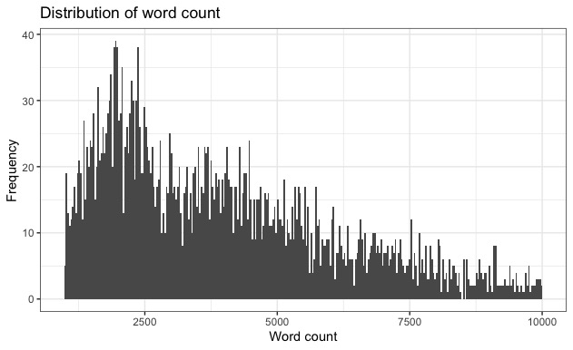

# Short Story Sentiment Analysis (Syuzhet)
 
## Data Overview

The presented data set *shortstorydata_sample.csv* is a sample (100 observations) of data scraped from the web site ["The Short Storie Library"](https://americanliterature.com/short-story-library). On the date of ethical web scraping (October 2019) there were 4346 stories by over 226 authors with a word count of between 8 and 51596 (size of a novella). Although the definition of a short story length is vague, in this analysis a short story is considered to be between 1000 and 10000 words long, resulting in a data set of 3573 stories and 209 authors (82 % of the total data). The average word count in this data subset is approx. 4000.

## Data Exploration

### Authors and their stories 

When looking at the distribution of authors and their number of works, we find 17 authors with 50 or more written stories (table 1) and an overall distribution represented in the histogram (figure 1).

Table 1: Authors with 50 or more works in data set.

| author | works |
| ---- | ----|
| O. Henry | 	251 |
| Guy de Maupassant|	181|
|Anton Chekhov	|180|
|Jack London	|164|
|Rudyard Kipling	|161|
|W. W. Jacobs|	141|
|Mark Twain|	113|
|H.H. Munro (SAKI)|	111|
|Nathaniel Hawthorne|	80|
|Henry van Dyke|	69|
|William Dean Howells|	68|
|Ambrose Bierce|	66|
|Edgar Allan Poe|	64|
|Mary E. Wilkins Freeman|	58|
|Kate Chopin|	54|
|P. G. Wodehouse|	54|
|Charles Dickens|	52|
|H. P. Lovecraft	|50|

According to this data, most authors are represented with only one story.

