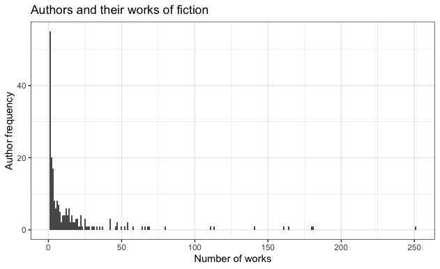

# Short Story Sentiment Analysis (Syuzhet)
 
## Data Overview

The presented data set *shortstorydata_sample.csv* is a sample (100 observations) of data scraped from the web site ["The Short Storie Library"](https://americanliterature.com/short-story-library). On the date of ethical web scraping (October 2019) there were 4346 stories by over 226 authors with a word count of between 8 and 51596 (size of a novella). Although the definition of a short story length is vague, in this analysis a short story is considered to be between 1000 and 10000 words long, resulting in a data set of 3573 stories and 209 authors (82 % of the total data). The median word count in this data subset is approx. 3500.

## Data Exploration

### Authors and their stories 

When looking at the distribution of authors and their number of works, we find 17 authors with 50 or more written stories (table 1) and an overall distribution represented in the histogram (figure 2).

Table 1: Authors with 50 or more works in data set.

| author | works |
| ---- | ----|
| O. Henry | 	251 |
| Guy de Maupassant|	181|
|Anton Chekhov	|180|
|Jack London	|164|
|Rudyard Kipling	|161|
|W. W. Jacobs|	141|
|Mark Twain|	113|
|H.H. Munro (SAKI)|	111|
|Nathaniel Hawthorne|	80|
|Henry van Dyke|	69|
|William Dean Howells|	68|
|Ambrose Bierce|	66|
|Edgar Allan Poe|	64|
|Mary E. Wilkins Freeman|	58|
|Kate Chopin|	54|
|P. G. Wodehouse|	54|
|Charles Dickens|	52|
|H. P. Lovecraft	|50|

According to this data, most authors are represented with only one to fifty stories.

### Parameter analysis

When we look at the relationship between word count and the number of unique number of words used by an author, then we find a positive correlation (see figure 3) with a downward trend. That means that the number of unique words used by any author increases slower than the total number of words used by that author.

Another relationship of interest: reading ease and sentence length (word count per sentence). The following formula was used to calculate the Flesch Reading Ease Score:

206.835 - 1.015 * ( words / sentences ) - 84.6 * ( syllable count / words )

Theoretically, the correlation between these two parameters is negative; the longer the average sentence written the more difficult the text is to read (see figure 4).

A selection of authors, each having written 10 or more stories, and their corresponding reading ease score is given in table 2.

Table 2: A selection of authors and reading ease (re)

|author|min re|max re|mean re|re sd|
|----|----|----|----|----|
|Katherine Mansfield|	81.57	|93.61|	87.04|	3.21|
|	Philip K. Dick	|76.05|	91.91|	86.92|	4.24|
|	D. H. Lawrence|	81.88	|93.19|	86.73|	3.25|
|	Ellis Parker Butler	|66.79|	92.00|	84.22|	7.55|
|	W. W. Jacobs	|74.40|	93.24|	84.14|	4.17|
|...||||
|	William Butler Yeats|	38.67|	76.69|	63.35|	11.50|
|	H. P. Lovecraft	|41.12	|84.55|	60.81|	7.58|
|	Edgar Allan Poe|	42.69|	84.13|	60.35|	9.28|
|	Charlotte M. Yonge|	48.61|	76.80|	58.39|	5.96|
|	Washington Irving|	37.44|	70.41|	55.87|	8.84|

## Syuzhet Sentiment Analysis
